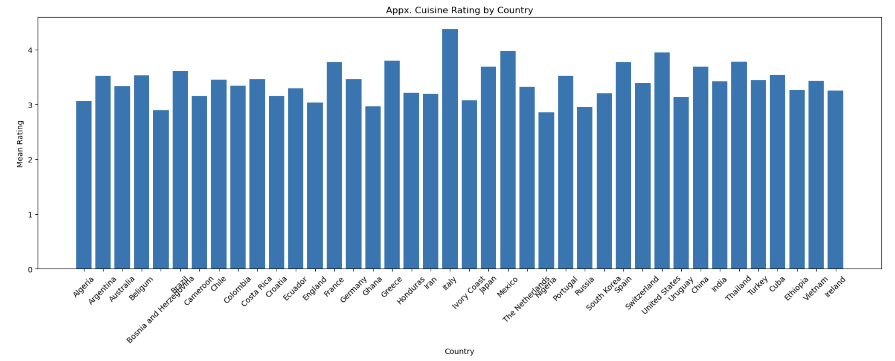
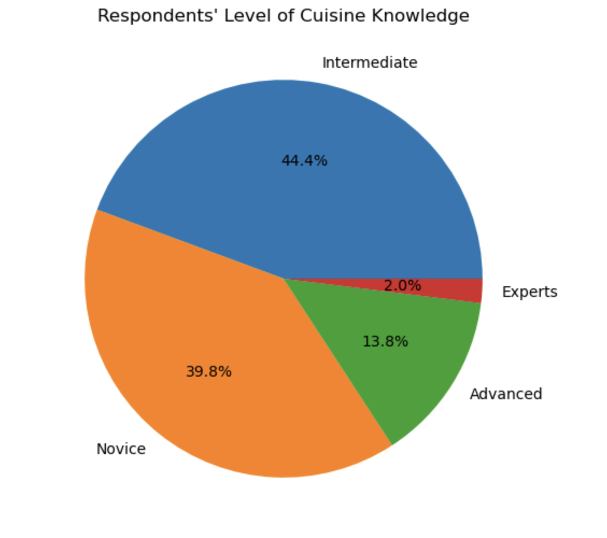
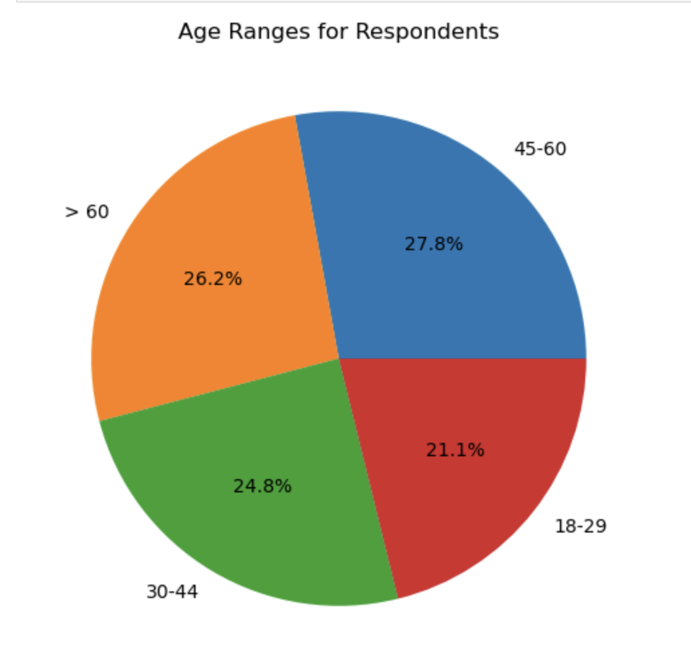

# Food World Cup
Food is one of the most important pieces of everyone's lives, since it's how we stay alive. A study was done with 1,373 respondents to test how they would rank each given country's cuisine. With many other factors coming into play such as gender, age, household income, knowledge on cuisine, etc., this gave a fair read of how a majority of people feel about certain cuisines.
## Who's The Best?

The bar chart above provides the approximate mean rating for each country, with Italy having the highest mean rating of 4.37 out of 5 and Nigeria having the lowest mean rating of 2.85 of 5. As someone who is Italian (and loves food), this was not a surprising discovery since Italian food is a very popular cuisine. 

## How Well Do You Know Your Foods?
As I previously stated, many factors were incorporated into this study. A big one was the question asking "Generally speaking, how would you rate your level of knowledge of cuisines from different parts of the world?"

Most respondents claim to have an intermeidate level of knowledge, but a mear 2.0% of respondents believe they are "food experts." I decided to put this to the test and raise the important question: "Does claiming to be an expert in different cuisines mean that you have a popular opinion?"

From calculating what the mean of the highest (Italy) and lowest (Nigeria) rated cuisines were from just the "experts" alone, these were the results:

- Italy: 4.28
- Nigeria: 2.79

As you can see, these mean ratings were lower- therefore, different- than the mean rating from the collective. From this, I concluded that even though these respondents claim to have the most knowledge about cuisine, it doesn't necessarily mean that their opinion was the most popular. 

## How Does Age Effect Results?

Compared to other statistics, the amount of respondents in each age group were pretty evenly spread out. Nevertheless, the highest percentages of respondents to an age range were those betwen the ages 45-60 and the lowest was between the ages of 18-29. 

Sometimes, age is an important factor because those who are older are more likely to have more years of opportunities to try different cuisines. Just like I did with the experts, I also calculated the mean for the highest and lowest rated cuisines only using these two groups. For the age range of 45-60:

- Italy: 4.30
- Nigeria: 2.91

As you can see from this information, these mean ratings were also different from the collective's rating. But for the age range of 18-29:

- Italy: 4.44
- Nigeria: 2.84

For this age group, they had a higher mean rating for Italy and almost exact mean rating for Nigeria. As someone in this age group, younger generations usually like to "stick to what they know" in terms of food. Since Italian food is a very popular cuisine, it makes sense that they would give a higher rating to something most popular. 

To conclude, I believe many aspects of a person's life factor into their taste in food. Whether that be their age, where they come from, or how wealthy they are, everyone has a different upbringing and choice when it comes to the food they consume. 